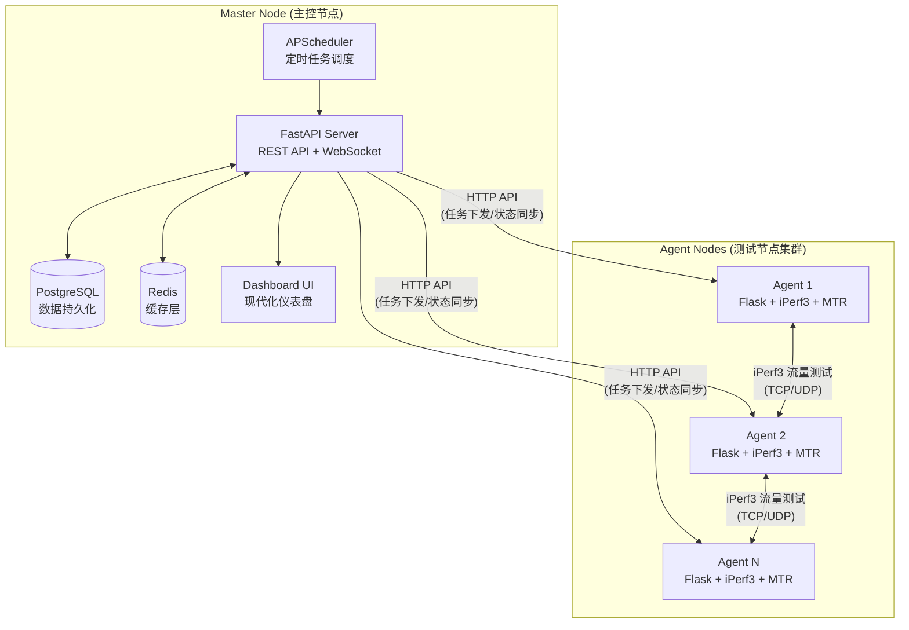
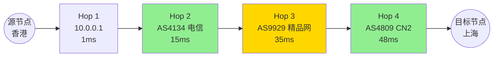

# iPerf3 分布式网络测试工具全攻略：从安装到进阶监控

:::details 📖 本文目录

import { Toc } from "@theme";

<Toc />

:::

## 项目简介

**iPerf3 分布式网络测试工具** 是一款基于 Python 开发的轻量级分布式网络监控套件。它通过 **Master（主控）** 与 **Agent（代理）** 的协同配合，实现了跨节点的带宽测试（iPerf3）、延迟监控（Ping）和路由追踪（Traceroute）可视化分析。

### 核心亮点

| 功能 | 说明 |
|------|------|
| 🚀 **一键安装更新** | 单条命令完成安装和版本更新，自动检测差异并增量升级 |
| 📊 **现代化仪表盘** | 商业级 UI 设计，实时监控节点状态、三网延迟、流媒体解锁 |
| ⏰ **定时任务调度** | 周期性自动测试，生成带宽趋势图表和流量统计报告 |
| 🛤️ **Metro 路由追踪** | 地铁线路图风格可视化、AS 路径分析、路由变化智能告警 |
| 📈 **Ping 趋势监控** | 实时延迟波动监测，Sparkline 迷你图 + 趋势箭头直观展示 |
| 🎬 **流媒体检测** | Netflix、Disney+、ChatGPT 等服务解锁状态自动识别 |
| 🤖 **Telegram 通知** | 路由变化、任务失败、节点离线等事件实时推送 |
| 🔐 **IP 白名单保护** | 防止 iPerf3 服务被恶意滥用 |

---

## 系统架构

项目采用解耦的分布式架构设计。主控节点负责数据持久化、任务调度与 Web 展示；代理节点则专注于执行网络探测任务并回传结果。



### 组件技术栈

| 组件 | 技术栈 | 核心职责 |
|------|--------|----------|
| **Master API** | FastAPI + PostgreSQL + Redis | REST API、Web 面板、调度器、缓存管理 |
| **Agent** | Flask + iPerf3 + MTR | 执行网络测试、路由追踪、流媒体检测、IP 过滤 |
| **Scheduler** | APScheduler | 定时 iPerf3 测试任务和 Traceroute 监控任务 |

---

## 环境准备

在开始部署前，请确保您的服务器满足以下条件：

### 系统要求

- **操作系统**：Ubuntu 20.04+、Debian 11+、CentOS 7+ 或其他主流 Linux 发行版
- **硬件配置**：至少 1 核 CPU / 512MB 内存（建议 2 核 / 1GB 以获得更好体验）
- **基础依赖**：已安装 Docker、Docker Compose 和 Git

### 网络端口

请确保以下端口在防火墙和安全组中已开放：

| 端口 | 协议 | 用途 |
|------|------|------|
| 9000 | TCP | Master API 接口 |
| 9100 | TCP | Web 仪表盘面板 |
| 8000 | TCP | Agent API 接口 |
| 62001 | TCP/UDP | iPerf3 默认测试端口 |

---

## 快速部署

### 安装主控节点 (Master)

主控节点包含数据库、缓存和管理后台，是整个系统的核心枢纽。

**步骤 1**：克隆项目仓库

```bash
git clone https://github.com/podcctv/iperf3-test-tools.git
cd iperf3-test-tools
```

**步骤 2**：执行一键安装脚本

```bash
bash ./update_iperf3_master.sh
```

安装过程中，脚本会自动完成以下工作：
- 拉取并构建 Docker 镜像
- 初始化 PostgreSQL 数据库
- 生成随机管理员密码
- 启动所有服务容器

**步骤 3**：访问仪表盘

安装完成后，访问以下地址进入管理面板：

```plaintext
http://<服务器 IP>:9100/web
```

> [!TIP]
> 首次启动时，系统会在终端输出自动生成的管理员密码，请妥善保存。如果忘记密码，可通过命令重置（见故障排查章节）。

### 安装代理节点 (Agent)

代理节点只需运行一条脚本即可完成自动注册。

```bash
curl -sSL https://raw.githubusercontent.com/podcctv/iperf3-test-tools/main/install_agent.sh | bash -s -- \
  --master-url http://<Master-IP>:9000 \
  --node-name "香港 BGP 节点"
```

**参数说明**：

| 参数 | 说明 |
|------|------|
| `--master-url` | 主控节点 API 地址（格式：`http://IP:9000`） |
| `--node-name` | 节点显示名称（支持中文，建议包含地区信息） |

安装完成后，新节点会自动出现在主控仪表盘的节点列表中。

---

## 核心功能详解

### 节点监控仪表盘

仪表盘首页提供全方位的节点状态概览：

- **节点状态卡片**：实时显示在线/离线状态，在线节点有呼吸动效
- **三网延迟**：同时监测电信、联通、移动三大运营商的连接延迟
- **Ping 趋势图**：通过 Sparkline 迷你图展示 24 小时延迟波动曲线
- **流媒体检测徽章**：自动识别 Netflix、Disney+、ChatGPT 等服务的解锁状态，并显示区域角标（如 HK / US / SG）

### 可视化路由追踪 (Metro-line)

该工具将复杂的 Traceroute 数据转化为类似"地铁线路图"的可视化界面：



**核心功能**：

- **AS 路径分析**：清晰展示数据包经过的自治系统（AS 编号及名称）
- **延迟胶囊徽章**：根据延迟自动着色（绿色 < 50ms / 黄色 < 150ms / 红色 > 150ms）
- **ISP/IX 徽章识别**：自动识别 CN2、9929、NTT 等优质线路
- **智能变化告警**：当路由节点发生变化时，系统通过 Telegram 推送高亮对比差异

### 定时任务调度

您可以设置周期性的 iPerf3 测试任务，系统将自动记录并分析：

- **上下行带宽**：支持 TCP / UDP 双模式测试
- **并行连接数**：可配置同时建立的连接数量
- **趋势图表**：24 小时内的带宽波动曲线
- **流量统计**：展示节点日消耗流量，适合管理有流量配额的 VPS

### Telegram 智能通知

配置 Telegram Bot 后，系统可自动推送以下事件：

- 📡 路由变化告警（附带跳点差异对比）
- ⚠️ 定时任务执行失败通知
- 🔴 节点离线告警

---

## 配置参考

### 环境变量

| 变量名 | 说明 | 默认值 |
|--------|------|--------|
| `DATABASE_URL` | PostgreSQL 连接字符串 | `postgresql://iperf:iperf_pass@db:5432/iperf_db` |
| `REDIS_URL` | Redis 连接字符串 | `redis://redis:6379` |
| `DASHBOARD_PASSWORD` | 仪表盘管理密码 | 首次启动自动生成 |
| `MASTER_API_PORT` | Master API 端口 | `9000` |
| `MASTER_WEB_PORT` | Web 面板端口 | `9100` |

### Docker Compose 示例

```yaml
# docker-compose.yml
services:
  master-api:
    build: ./master-api
    ports:
      - "9000:9000"
    depends_on:
      - db
      - redis
    environment:
      - DATABASE_URL=postgresql://iperf:iperf_pass@db:5432/iperf_db
      - REDIS_URL=redis://redis:6379

  db:
    image: postgres:15-alpine
    environment:
      POSTGRES_USER: iperf
      POSTGRES_PASSWORD: iperf_pass
      POSTGRES_DB: iperf_db

  redis:
    image: redis:7-alpine
```

---

## API 接口一览

### 核心接口

| 方法 | 路径 | 说明 |
|------|------|------|
| GET | `/nodes` | 获取所有已注册节点 |
| POST | `/nodes` | 注册新节点 |
| GET | `/nodes/{id}/ping-history` | 获取节点 Ping 历史数据 |
| POST | `/tests` | 执行即时测试任务 |
| GET/POST | `/schedules` | 定时任务 CRUD 管理 |

### 路由追踪接口

| 方法 | 路径 | 说明 |
|------|------|------|
| POST | `/api/trace/run` | 执行即时 Traceroute |
| GET | `/api/trace/schedules` | 获取追踪定时任务列表 |
| GET | `/api/trace/results` | 获取历史追踪结果 |

### Telegram 配置接口

| 方法 | 路径 | 说明 |
|------|------|------|
| GET | `/admin/telegram` | 获取当前 Telegram 配置 |
| POST | `/admin/telegram` | 保存 Telegram Bot 配置 |
| POST | `/admin/telegram/test` | 发送测试消息验证配置 |

> [!NOTE]
> 完整的 API 交互式文档可访问 `http://<服务器 IP>:9000/docs` 查看（基于 Swagger UI）。

---

## 更新与维护

### 常规版本升级

在 Master 节点执行以下命令进行版本升级：

```bash
cd iperf3-test-tools
git pull origin main
docker compose build --no-cache master-api
docker compose up -d
```

### Agent 自动更新

Agent 节点支持 Watchdog 自动更新机制。运行以下脚本开启自动同步：

```bash
curl -sSL https://raw.githubusercontent.com/podcctv/iperf3-test-tools/main/setup-agent-autoupdate.sh | sudo bash
```

启用后，当 Master 版本升级时，Agent 会自动检测并完成更新。

---

## 故障排查

### 常见问题速查表

| 问题现象 | 可能原因 | 解决方法 |
|:---------|:---------|:---------|
| **容器无法启动** | 端口冲突或依赖服务未就绪 | 执行 `docker logs iperf3-test-tools-master-api-1` 查看日志 |
| **Agent 显示离线** | 防火墙拦截 8000 端口 | 执行 `ufw allow 8000/tcp` 并验证 `curl <Agent-IP>:8000/health` |
| **iPerf3 测试失败** | 62001 端口未开放 | 在安全组中开放 TCP/UDP 62001 端口 |
| **忘记面板密码** | 初始密码未保存 | 执行密码重置命令（见下方） |

### 密码重置命令

```bash
docker compose exec master-api python -m app.auth --set-password 'YourNewPassword' --force
```

### 强制重建容器

```bash
docker compose down
docker compose up -d --build --force-recreate
```

---

## 结语

iPerf3 分布式网络测试工具通过极简的部署流程和强大的可视化分析能力，为多机房网络性能管理提供了高效的解决方案。无论是日常的带宽监控、路由追踪分析，还是跨节点的网络质量对比，该工具都能满足您的需求。

如有任何问题或建议，欢迎前往 [GitHub 仓库](https://github.com/podcctv/iperf3-test-tools) 提交 Issue 或参与贡献！

---

## 参考链接

- [GitHub 仓库](https://github.com/podcctv/iperf3-test-tools)
- [在线 API 文档](http://your-ip:9000/docs)
- [问题反馈](https://github.com/podcctv/iperf3-test-tools/issues)
